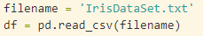
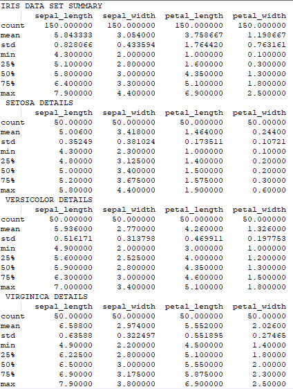

# Pands-project2021-G00048625

- [Pands-project2021-G00048625](#pands-project2021-g00048625)
  - [Project Brief:](#project-brief)
  - [Summary of Fisher's Iris Data Set.](#summary-of-fishers-iris-data-set)
  - [What is Python and what is it used for:](#what-is-python-and-what-is-it-used-for)
  - [Analysing Fisher's Iris Dataset Using Python:](#analysing-fishers-iris-dataset-using-python)
    - [Applications used:](#applications-used)
  - [Iris Dataset Code and Analysis:](#iris-dataset-code-and-analysis)
    - [Libraries Used:](#libraries-used)
    - [Dataset Download and Import:](#dataset-download-and-import)
    - [Summary of each variable:](#summary-of-each-variable)
    - [Histogram of each variable type:](#histogram-of-each-variable-type)
    - [Scatterplots of each Pair of Variables:](#scatterplots-of-each-pair-of-variables)
  - [Further Analysis:](#further-analysis)
    - [Unsupervised Learning:](#unsupervised-learning)
    - [Application of knowledge into practice:](#application-of-knowledge-into-practice)
- [References:](#references)

## Project Brief:

**Problem statement:**

This project concerns the well-known Fisher’s Iris data set. You must research the data set
and write documentation and code in Python to investigate it.Research the data set online and 

[1]. Write a summary about it in your README.

[2]. Download the data set and add it to your repository.

[3]. Write a program called analysis.py that:

- outputs a summary of each variable to a single text file,
- saves a histogram of each variable to png files, and
- outputs a scatter plot of each pair of variables. 

## Summary of Fisher's Iris Data Set.

The Fisher Iris Data Set is multivariate dataset . The data set  is the measurement of the length and width of both sepals and petals of three different species of the Iris flower (Setosa, Versicolor and Virginica) . In total there are 150 measurements. The British statistician and biologist Ronald Fisher published this dataset in his 1936 paper “The use of multiple measurements in taxonomic problems” as an example of linear discriminant analysis. Initially data was only collected for two of the species (Setosa and Versicolor) to demonstate the dicriminant analysis. The Iris virginica data was collected to extend Fisher’s technique and to test Randolph’s (1934) hypothesis that Iris versicolor is a polyploid hybrid of the two other species which is related to the fact that Iris setosa is a diploid species with 38 chromosomes, Iris virginica a tetraploid and Iris versicolor having 108 chromosomes is a hexaploid.[1]. This is perhaps the best known database to be found in the pattern recognition literature. Fisher's paper is a classic in the field and is referenced frequently to this day. If you search for Iris Dataset on google you will actually get 3.9 million results. That alone will tell us how often this dataset is being used and researched by others. The reasons this dataset is so often used is: 

-   Iris dataset contains 150 observations, it is small and simple but not trivial. For beginners this is a great place to start and learn some simple tricks to plot and analyze data.

- The task it poses of discriminating between three species of Iris from measurements of their petals and sepals is simple but challenging.

- The data is real data, but apparently of good quality. In principle and in practice, test datasets could be synthetic and that might be necessary or useful to make a point. Nevertheless, few people object to real data.

As previously mentioned Fisher used this dataset as an example of linear discriminant analysis (LCA). LCA is a method used in statistics and other fields, to find a linear combination of features that characterizes or separates two or more classes of objects or events. Linear Discriminant Analysis(LDA) is a very common technique used for supervised classification problems. Fisher's Iris data has become a popular set of labeled data for testing—and especially for comparing—clustering algorithms and classifiers. 
 
## What is Python and what is it used for:

Python is a popular multi-purpose **programming language** widely used for its flexibility, as well as its extensive collection of libraries, which are valuable for analytics and complex calculations.Python’s extensibility means that it has thousands of libraries dedicated to analytics.[2]

Python is a general-purpose coding language—which means that, unlike HTML, CSS, and JavaScript, it can be used for other types of programming and software development besides web development. That includes back end development, software development, data science and writing system scripts among other things. 

The application we used Python for in this course was scripting and data science. The  objective of this course was to become comfortable with coding and used the python languauge to do this.Even though python is versatile and powerful its is relatively easy to learn. Several reasons for this are:

- Python basics (things like Python’s syntax, keywords, and data types) can be learned in as little as 6-8 weeks.
- You can learn python basics for free. There are several python sites such as the python software foundation that offer free tutorials for beginners.
- Python has a massive support community and is an open source coding language.Being open-source is what allows languages to have libraries, frameworks, and other tools that keep the Python language relevant and adaptable over time. But open-source only lives up to its potential if there’s a supportive community of users engaged with the language.
- Being general-purpose means the Python language can do a lot…which is why heavy tech hitters like Google, Facebook, and Instagram all use Python programming to build parts of their tech stacks.Python’s versatility means that you’ll have an incredibly wide range of work options.
- Automation is another area where it pays to learn Python. Python’s ability to write system scripts means you can create simple Python programs to automate mindless tasks that eat away at your productivity. The time you’ll save by knowing how to automate processes with Python is a huge selling point for learning the language.

## Analysing Fisher's Iris Dataset Using Python:

### Applications used:

CMDER- CMDER is a free software package, portable console emulator specifically for Windows. CMDER is a great utility for developers and coders. It is used primarily for running scripts but has many more functions. I cloned my respiratory for the project from github through cmder and saved it onto my machine.

VSCODE- Visual Studio Code is a freeware source-code editor made by Microsoft for Windows, Linux and macOS. All code for this project was written though this application. It is an amazing platform for someone beginning their programming/scripting journey as it is incredibly user friendly.

GITHUB-GitHub is a cloud-based hosting service that lets you manage Git repositories. If you have open-source projects that use Git, then GitHub is designed to help you better manage them. This was used to store all the code that was written and the overall project. The beauty is that you can access this cloud base service from any machine.[3] 

## Iris Dataset Code and Analysis:

### Libraries Used:

In order to analyse and visualize the Iris Dataset in VSCODE we  installed several libraries. A library is a collection of pre-combined codes that can be used iteratively to reduce the time required to code. They are particularly useful for accessing the pre-written frequently used codes, instead of writing them from scratch every single time. Similar to the physical libraries, these are a collection of reusable resources, which means every library has a root source. This is the foundation behind the numerous open-source libraries available in Python.[4]

**Matplotlib**-is a comprehensive library for creating static, animated, and interactive visualizations in Python.

**Numpy**-is a general-purpose array-processing package. It provides a high-performance multidimensional array object, and tools for working with these arrays. It is the fundamental package for scientific computing with Python.

**Pandas**-is a fast, powerful, flexible and easy to use open source data analysis and manipulation tool, built on top of the Python programming language.

**Seaborn**- is a Python data visualization library based on matplotlib. It provides a high-level interface for drawing attractive and informative statistical graphics.

### Dataset Download and Import:

The start of analysis requires us to download the Iris dataset. This was taken from UCI Machine Learning Respository[5]. The data was downloaded from the Data Folder on this site through notepad and then saved as a csv file. I saved this in my pands-project folder in csv and txt format.Due to the fact the Iris Data Set is so often analysed using python is it actually built in to the sklearn datasets which is another library that you can import from. The dataset can be printed out as a data array set. Why researching the dataset I found that another way to download the dataset was through Seaborn as this library has built in datasets also. Seaborn is part of the PyData stack hence accepts Pandas’ data structures. However the brief of this project was to download so that is what we did. The dataset was defined as filename and then read in using the pandas lib and defined as df.

### Summary of each variable:

The describe() function computes a summary of statistics pertaining to the dataframe coloums. The describe function was used on the entire dataset and separately computed for the three different species. Count, mean, std, min, 25%, 50%, 75% and max values are outputted for the 4 variables. From the summary below you can see the mean values for the 4 variables are quite similar but there is a marked difference in the mean for the petal length and width for Iris Setosa when compared with the other two species. The standard  deviation is quite low for all species in petal length (the highest is Iris Virginica at 0.55). However the collective group S.D is at 1.76 for petal length. 3 times higher than Iris Virginica. While the variation in the petal length is still optimum ( <1 C.V). This higher SD for the group stats indicates there is variation between the species for the petal length. 

### Histogram of each variable type:

The Histogram plots show us the  frequency distribution for each of the variables. The code written showed histograms for each individual variable (sepal length, sepal width, petal length and petal width). The individual histogram plots per variable revealed that sepal length and width had a fairly normal distribution over they range of vales that were measured. The petal width and length did not follow a normal distribution pattern and were quite skewed with a Plateau or Multimodal Distribution. This Multimodal distribution would make sense because this model is of the collective range of three different species.[6]
 

The second type of histogram code written was for each variable but species specific. The histograms for petal length here per species are again Multimodal distributions. The most significant histogram here is Iris Setosa for petal length. The histogram is heavily skewed to the right making it quite distinct from the other histograms.

Finally code was written for distplots which I think represented the data in a manner that variables could be distinguished per species 

Using the displot above of petal length Iris.Setosa is easily disguishable from the other two species. There is a slight overlap on virginica and versicolor but ditinct distributions nonetheless.[11]

Using this displot of petal width. Iris setosa is again easily identified. There is overlap again with Versicolor and Virginica. 

It would be correct to assume we could use this graphical analysis to definitively separate setosa from the other two however you would need further analysis to distinguish between Virginica and Versicolor.

### Scatterplots of each Pair of Variables:

Scatterplots show how much one variable is affected by another. The relationship between two variables is called their correlation[12]. The closer the data points come when plotted to making a straight line, the higher the correlation between the two variables, or the stronger the relationship. The initial scatterplot code generated the entire data and was not species specific. As can be seen from the scatterplots above The sepal variables do not appear to have much correlation whereas the petal variables show a high degree of correlation.[13]

The second scatter plot generated is seen above. Here the code is species specific and Iris Setosa is easily distinguished from the other two species on both sepal and petal variables. The petal width and length scatterplot is better at distinguishing the three species type although there is some over lap between Iris Vericolour and Iris Virginica. The species specific correlation is much higher also with the petal variables[7].

The above figure shows the correlation statistics between all the variable. Perfect positive correction would produce a number of 1. As seen above when the variable is compared against itself. However there are three main variables with high positive correlation.[10]

  [1] Petal Width and Petal Length (0.96)

  [2] Petal Length and Sepal Length (0.87)

  [3] Petal Width and Sepal Length (0.81)

  

  The regplot in the seaborn module above shows the high degree of correlation between the petal length and width. This plot is used to visualize a linear relationship as determined through regression.The figure will draw a scatterplot of two variables, x and y, and then fit the regression model y ~ x and plot the resulting regression line and a 95% confidence interval for that regression:[14]

  

  The regplot above shows the two variables that showed the least correlation. The sepal width and the petal length. It is clear to see there is no linear relationship here.[15]
 

The pairplot generated above is incredibly descriptive and pairs all variables together. There is obvious data clusters per species in this pairplot but there is still overlap in each variable between Iris virginica and Iris Versicolor. In every paired plot here Iris setosa can be easily identified among the other two species[16].

Observations:

- Petal_length and petal_width are the most useful features to identify various flower types.
- While Setosa can be easily identified (linearly separable), Virginica and Versicolor have some overlap (almost linearly separable).

## Further Analysis:

### Unsupervised Learning:

While researching the Iris Dataset there was copious amount of information about supervised versus unsupervised learning. Supervised learning, also known as supervised machine learning, is a subcategory of machine learning and artificial intelligence. It is defined by its use of labeled datasets to train algorithms that classify data or predict outcomes accurately. Unsupervised learning is where you only have input data (X) and no corresponding output variables.The goal for unsupervised learning is to model the underlying structure or distribution in the data in order to learn more about the data.
These are called unsupervised learning because unlike supervised learning above there is no correct answers and there is no teacher. Algorithms are left to their own devises to discover and present the interesting structure in the data[18].

To look at some unsupervised learning in python using the Iris Dataset code was written that removed labels from the data. Species is not known. The sepal length and width was used to view on a scatterplot as was petal length and width[19].

The unsupervised scatterplots above show us that there seems to be no relationship/null relationship between the sepal length and width but there does seem to be two broad clusters. The unsupervised scatterplot for the petal length and width shows a strong positive linear realtionship with two obvious clusters[12].

The k-means clustering method is an unsupervised machine learning technique used to identify clusters of data objects in a dataset[20].It is a clustering algorithm that is a simple unsupervised algorithm used to predict groups from an unlabeled dataset. In unsupervised machine learning, you don’t need to supervise the model. Here the model does its own work to find the patterns in the dataset. And then it automatically labels the unlabeled data[21].

Code was written that imported the Iris dataset from Skitit Learn Library. The sepal and petal lengths and widths are in an array called iris.data. The species classifications for each of the 150 samples is in another array called iris.target. Iris.target is an array of integers used to represent the Iris species. 0=Setosa, 1=Versicolor, 2=Virginica. Below is the target array for the Iris Dataset.

The K-means algorithm is used to identify clusters.The KMeans algorithm clusters data by trying to separate samples in n groups of equal variance. We already know the amount of clusters for the iris dataset so we can input cluster number to the algorithm as 3. If you did not know the cluster number of the unlabelled data you could use code for the elbow method which predicts the amount of clusters in a set of data[23]. We used the predifined K-means algorithm module that is available in Skitit Learn library.  Using the K-Means algorithm we fit a model of the unlabelled iris dataset. The K-means algorithm will then print out a set of target arrays that are predicted based on the dataset it analysed[24]. 

The KMeans model object also assigns integer ids for the three clusters (n_clusters =3 above), namely 0, 1, 2. Its important to note that the KMeans model has no knowledge of the iris.target data, and the clusters being given ids 0,1,2 is just a coincidence. The below array was printed from the KMmodel.label_. 

This k-means model array looks very similar to the iris.target array. However there is some obvious misclassifications between the 2 and 0 targets.

We then used code to visulaise this data in a scatterplot before and after the k-means classification.

As can be seen from the plots above. The k-means clustering algorithm was quite accurate in predicting the clusters in the Iris Dataset. 

The pandas crosstab and the sklearn metrics were both used to evaluate the quality of the output of a classifier on the iris data set.

The confusion matrix tells us that:

[1]  50 samples of taget 0 were identified correctly.

[2]  48 samples of target 1 were identified correctly and 2 were identified as target 2.

[3] 36 samples of target 2 were identified correctly and 14 were misclassified as target 1.

Also included in the code for the scatterplots was the accuracy score which was found to be 0.89%.
When we manually coded for accuracy above in the kmeans code we found to be the same 0.89%. The k-means algorithm predicted to a high degree of accuracy the correct species type based on the cluster analysis.

### Application of knowledge into practice:

In order to apply the different processes and methods into practice that I have learnt here I wanted to apply it to information I might deal with in my job as a laboratory scientist. I constructed a Covid Stats file with 4 numeric variables within three categories. The variables were Age, D-Dimer test result, Vitamin-D test result and Hospital LOS (Length of Stay). These variables were meaured for three categories of patients: 

[1] Patients with Heart Disease

[2] Patients with Asthma

[3] Patients with No Condition

The dataset was completely fictious and used solely to apply knowledge from this course into practice. 

# References:

[1] [Iris Data](https://link.springer.com/chapter/10.1007/978-1-4612-5098-2_2)

[2] [Tech 101: What Is Python? Plus, 13 Reasons Why You Should Learn It](https://skillcrush.com/blog/what-is-python/)

[3] [Git Handbook](https://guides.github.com/introduction/git-handbook/#:~:text=GitHub%20is%20a%20Git%20hosting,apps%20in%20the%20GitHub%20Marketplace.)

[4] [34 Open-Source Python Libraries You Should Know About](https://www.mygreatlearning.com/blog/open-source-python-libraries/#Library)

[5] [Iris Data Set - UCI Machine Learning Repository](http://archive.ics.uci.edu/ml/datasets/Iris/)

[6] [Box plot and Histogram exploration on Iris data](https://www.geeksforgeeks.org/box-plot-and-histogram-exploration-on-iris-data/)

[7][Python IRIS Data visualization and explanation](https://www.kaggle.com/abhishekkrg/python-iris-data-visualization-and-explanation)

[8][Visualizing distributions of data](https://seaborn.pydata.org/tutorial/distributions.html)

[9][How to use Seaborn for Data Visualization](https://towardsdatascience.com/how-to-use-seaborn-for-data-visualization-4c61fc488ec1)

[10][Exploration of IRIS Dataset](https://rpubs.com/shailesh/iris-exploration)

[11][seaborn.kdeplot](https://seaborn.pydata.org/generated/seaborn.kdeplot.html)

[12][A Complete Guide to Scatter Plots](https://chartio.com/learn/charts/what-is-a-scatter-plot/#:~:text=Scatter%20plots'%20primary%20uses%20are,are%20common%20with%20scatter%20plots.)

[13][R Scatter Plot – Base Graph](https://www.learnbyexample.org/r-scatter-plot-base-graph/)

[14][Data Visualization with Python and Seaborn — Part 4: LM Plot & Reg Plot](https://medium.com/@neuralnets/data-visualization-with-python-and-seaborn-part-4-9b0119887130)

[15][Introduction to Machine Learning in Python](https://www.datacamp.com/community/tutorials/introduction-machine-learning-python?utm_source=adwords_ppc&utm_campaignid=898687156&utm_adgroupid=48947256715&utm_device=c&utm_keyword=&utm_matchtype=b&utm_network=g&utm_adpostion=&utm_creative=229765585186&utm_targetid=aud-299261629574:dsa-429603003980&utm_loc_interest_ms=&utm_loc_physical_ms=20487&gclid=Cj0KCQjw9_mDBhCGARIsAN3PaFMqV46OWTzY86tg_8vc0yBOr_Z2-IGgk8fhj_zxq5z-agq1-nRwRbYaAtOeEALw_wcB)

[16][Seaborn pairplot example-Python Tutorial](https://pythonbasics.org/seaborn-pairplot/)

[17][Basic Syntax-MarkdownGuide](https://www.markdownguide.org/basic-syntax/)

[18][Supervised and Unsupervised Machine Learning Algorithms](https://machinelearningmastery.com/supervised-and-unsupervised-machine-learning-algorithms/)

[19][Machine Learning Basics and Perceptron Learning Algorithm](https://shunsvineyard.info/2017/10/22/machine-learning-basics-and-perceptron-learning-algorithm/)

[20][K-Means Clustering in Python: A Practical Guide](https://realpython.com/k-means-clustering-python/#conclusion)

[21][K Means Clustering in Python : Label the Unlabeled Data](https://www.datasciencelearner.com/k-means-clustering-in-python-label-dataset/)

[22][Scikit Learn - KMeans Clustering Analysis with the Iris Data Set](https://www.youtube.com/watch?v=asW8tp1qiFQ)

[23][K-Means Elbow Method Code For Python](https://predictivehacks.com/k-means-elbow-method-code-for-python/)

[24][Playing with IRIS data – KMeans clustering in python](https://constantgeeks.com/2017/01/11/playing-with-iris-data-kmeans-clustering-in-python/)

